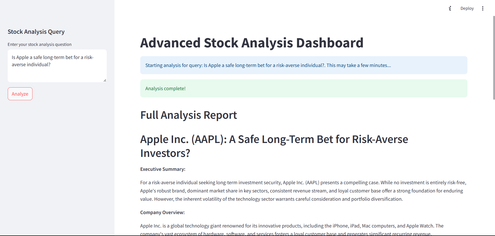

# 📊 StockSage-AI

An advanced, AI-powered stock analysis dashboard built with **CrewAI**, **Streamlit**, and **yFinance**, this project leverages multiple LLM agents to deliver deep, multi-layered insights for retail and institutional investors alike.

Whether you're a seasoned investor or a curious learner, StockSage-AI provides you with everything from **fundamentals and technicals** to **risk metrics** and **real-time news sentiment**—all generated through intelligent agents.

---

## 🧠 Features

- 📌 **Natural Language Query Interface**
  
  Ask questions like _“Is Apple a safe long-term bet for a risk-averse investor?”_ and get a complete markdown-based report tailored to your query.

- 🧑‍💼 **Modular LLM Agents (via CrewAI)**  
  - 📄 Stock Researcher  
  - 📊 Financial Analyst  
  - 📰 News Analyst  
  - ✍️ Report Writer  

- 📉 **Real-Time Data Retrieval**
  
  Using `yFinance` for up-to-date financial, technical, and news data.

- 🔍 **Multi-Dimensional Stock Analysis**  
  - ✔️ Fundamental metrics (PE, PEG, margins, FCF, etc.)  
  - ✔️ Technical indicators (SMA, RSI, MACD, etc.)  
  - ✔️ Risk evaluation (Volatility, Beta, Sharpe, Sortino)  
  - ✔️ News sentiment breakdown  

- 🧾 **Auto-Generated Investment Reports**
  
  Reports are structured with executive summaries, analysis focus, investment recommendations, and key takeaways—tailored to user intent and expertise.

---

## 🖥️ UI Preview



---

## 🧰 Tech Stack

| Component | Description |
|----------|-------------|
| 🧠 [CrewAI](https://github.com/joaomdmoura/crewai) | Multi-agent orchestration |
| 📊 [yFinance](https://github.com/ranaroussi/yfinance) | Real-time stock market data |
| 🌐 [Streamlit](https://streamlit.io/) | Interactive dashboard frontend |
| 📚 Pandas, NumPy | Data processing and statistics |
| 🔐 Python-dotenv | Secure API key management |
| 🧩 Groq LLM (Gemma-2 9B) | Agent intelligence (via `groq/gemma2-9b-it`) |

---

## 📦 Installation

```bash
# Clone the repository
git clone https://github.com/<your-username>/StockSage-AI.git
cd StockSage-AI

# Set up environment
python -m venv venv
source venv/bin/activate  # or venv\Scripts\activate on Windows

# Install dependencies
pip install -r requirements.txt

# Add your GROQ_API_KEY in a .env file
echo "GROQ_API_KEY=your_api_key_here" > .env

# Run the app
streamlit run main.py
```

---

## 🔐 .env Example

```env
GROQ_API_KEY="your_groq_api_key_here"
```

---

## 🧪 Example Query Prompts

- “Analyze Microsoft’s fundamentals and give a future outlook.”
- “Is Tesla a risky stock in the current macro environment?”
- “Perform a technical analysis of NVDA for the last 6 months.”
- “Summarize recent news sentiment on Google and suggest a position.”

---

## 📈 Sample Report Structure

```shell
## 📋 Executive Summary
Summary of analysis and a clear recommendation.

## 🏢 Basic Stock Information
Company, Sector, Market Cap, etc.

## 🔍 Fundamental Analysis
PE Ratio, EPS, ROE, Margins, Cash Flow, etc.

## 📉 Technical Analysis
RSI, SMA50, MACD, and trend indicators.

## ⚠️ Risk Assessment
Beta, Volatility, VaR, Max Drawdown, Sharpe Ratio, etc.

## 📰 News Summary
Latest news sentiment affecting price outlook.

## ✅ Investment Recommendation
Clear Buy / Hold / Sell based on data and sentiment.
```

---

## 📝 License
This project is licensed under the **MIT License**.
